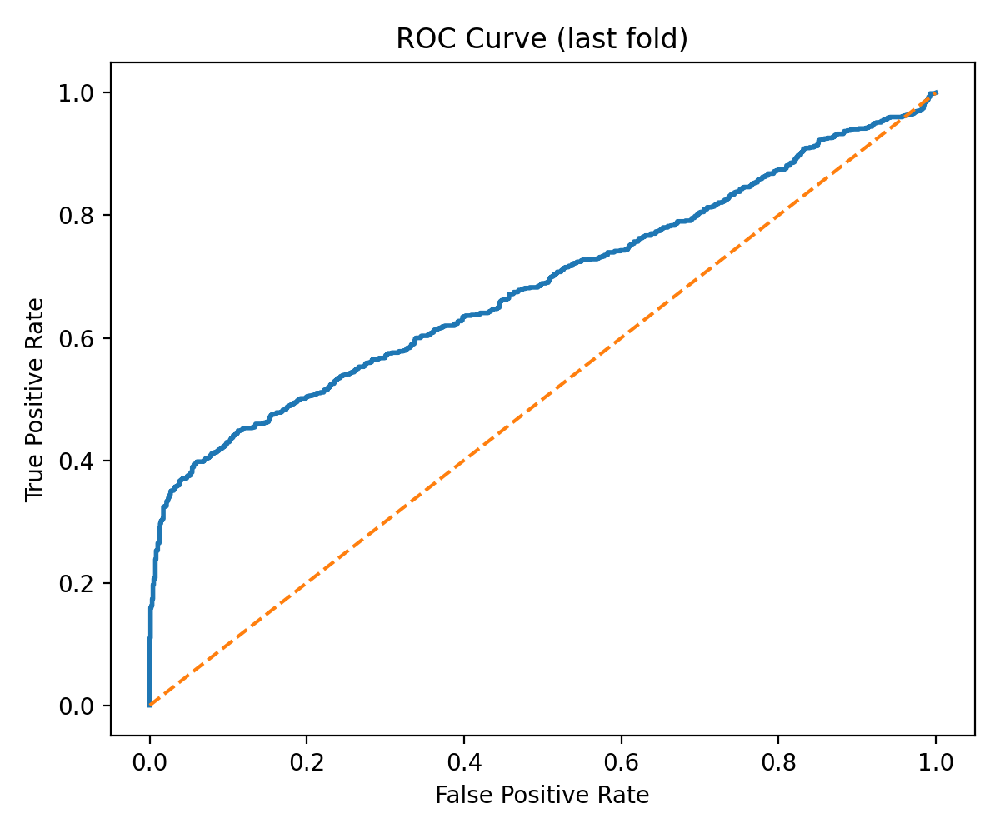
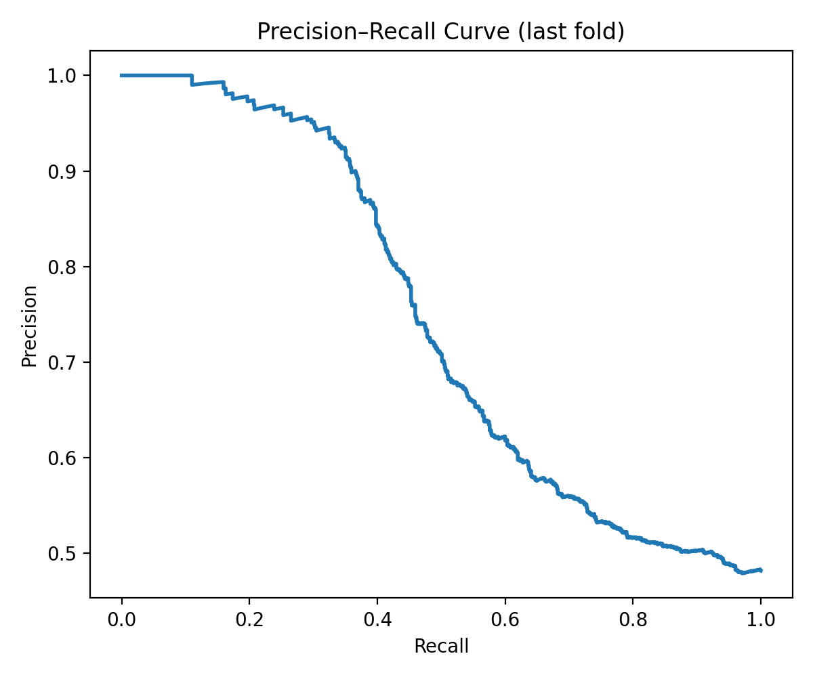
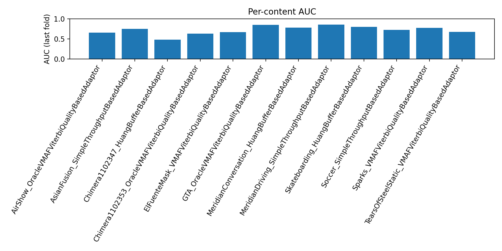
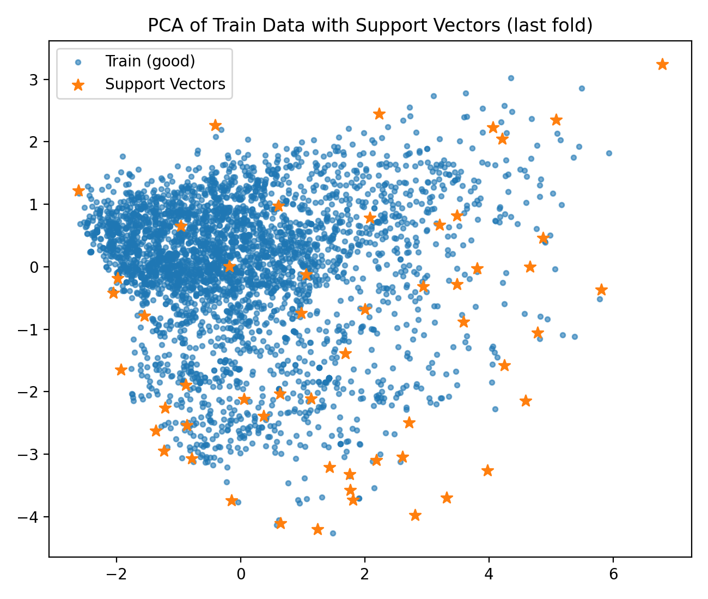

# 🧠 FISVDD-QoE: Fast Incremental SVDD for Video Quality-of-Experience Anomaly Detection  

[](https://www.python.org/)
[](https://fastapi.tiangolo.com/)
[](#datasets)
[](LICENSE)
[](#)

---

This repository implements an end-to-end **Quality of Experience (QoE)** anomaly detection system for **video streaming** using the **Fast Incremental Support Vector Data Description (FISVDD)** algorithm.  

Supports **multiple datasets** with adaptive feature engineering:
- **LIVE-Netflix-II**: AUC 0.74 | 6 features | VMAF-based quality metrics
- **LFOVIA QoE**: AUC 0.80 | 4 features | Rebuffering + visual quality

Detects playback degradation (rebuffering, bitrate drops, quality instability) and adapts in real time through an incremental API.

---

## 📁 Project Structure

```
FISVDD_QoE_VideoStreaming/
│
├── resources/                          # Dataset files (organized by dataset)
│   ├── LIVE_NFLX_II/                  
│   │   ├── LIVE_NFLX_II_FISVDD_train.csv
│   │   └── LIVE_NFLX_II_windows_minimal.csv
│   └── LFOVIA_QoE/
│       ├── LFOVIA_QoE_train.csv
│       └── LFOVIA_QoE_test.csv
│
├── configs/                            # Dataset-specific configurations
│   ├── __init__.py                    # Config registry
│   ├── base_config.py                 # Base configuration class
│   ├── live_nflx_ii_config.py        # LIVE-Netflix-II settings
│   └── lfovia_qoe_config.py          # LFOVIA QoE settings
│
├── artifacts/                          # Trained models (by dataset)
│   ├── LIVE_NFLX_II_fisvdd.joblib
│   └── LFOVIA_QoE_fisvdd.joblib
│
├── results/                            # Evaluation results
│   ├── LIVE_NFLX_II/                  # ROC curves, metrics, plots
│   ├── LFOVIA_QoE/
│   └── comparative_analysis/          # Cross-dataset comparisons
│
├── scripts/                            # Utility scripts
│   └── exploration/                   # Dataset exploration tools
│
├── tests/                              # Unit and integration tests
│   ├── test_fisvdd_unit.py
│   └── test_api.py
│
├── fisvdd.py                          # Core FISVDD algorithm
├── common_features.py                 # Generic preprocessing utilities
├── train_fisvdd.py                    # Multi-dataset training script
├── test_fisvdd.py                     # Multi-dataset evaluation
├── benchmark_fisvdd.py                # K-fold cross-validation
├── compare_datasets.py                # Cross-dataset analysis
├── app.py                             # FastAPI incremental serving
└── README.md
```


---

## ⚙️ Installation

```bash
# Create environment
python -m venv .venv
source .venv/bin/activate   # On Windows: .venv\Scripts\activate

# Install dependencies
pip install -r requirements.txt
```

**Main dependencies**
- numpy, pandas, scikit-learn
- fastapi, uvicorn
- joblib, pydantic
- matplotlib (for visualization)

---

## 🎞 Datasets

This project supports multiple video QoE datasets with dataset-specific feature engineering.

### 📘 LIVE-Netflix-II (2018)

**Source**: [LIVE-NFLX Video QoE Database](http://live.ece.utexas.edu/research/LIVE_NFLXStudy/nflx_index.html)  
**Content**: 420 distorted video sequences with subjective QoE scores  
**Features**: 6 VMAF-based quality metrics  
**Performance**: AUC 0.74 | AP 0.71 | F1 0.42

| Feature | Description |
|---------|-------------|
| `vmaf_mean`, `vmaf_std`, `vmaf_mad` | Quality variation from Netflix VMAF |
| `bitrate_mean` | Average bitrate (kbps) |
| `stall_ratio` | Ratio of stalled frames |
| `tsl_end` | Time since last stall |

### 📗 LFOVIA QoE Dataset

**Source**: [IIT Hyderabad LFOVIA](https://iith.ac.in/~lfovia/)  
**Content**: 54 videos (18 pristine + 36 distorted) with continuous QoE scores  
**Features**: 4 streaming + visual quality metrics  
**Performance**: AUC 0.80 | AP 0.42 | F1 0.49

| Feature | Description |
|---------|-------------|
| `TSL` | Time since last rebuffer event |
| `Nrebuffers` | Number of rebuffering events |
| `NIQE` | No-reference image quality (naturalness) |
| `SSIM` | Structural similarity index |

---

## 🧮 Training the Model

Train on any supported dataset:

```bash
# LIVE-Netflix-II
python train_fisvdd.py --dataset LIVE_NFLX_II

# LFOVIA QoE
python train_fisvdd.py --dataset LFOVIA_QoE
```

This script:
1. Loads the training data  
2. Applies preprocessing (`clip + log1p` on bitrate and stall features)  
3. Standardizes inputs with `StandardScaler`  
4. Uses the median heuristic to compute σ  
5. Trains FISVDD on “good” (QoE > 0) windows  
6. Saves model artifacts (`fisvdd_artifacts.joblib`)

---

## 🧪 Evaluation

Evaluate on any dataset:

```bash
python test_fisvdd.py --dataset LIVE_NFLX_II
python test_fisvdd.py --dataset LFOVIA_QoE
```

Example output:
```
[TEST] contents=3 rows=462 | AUC=0.832 AP=0.786
[TEST] threshold τ=-0.0021 flags=6.5%
```

✅ Metrics:
- AUC (Area Under ROC)
- Average Precision (AP)
- Precision / Recall / F1
- Flag rate (%)

---

## 🚀 Incremental FastAPI Service

Start the API server:

```bash
uvicorn app:app --host 0.0.0.0 --port 8000
```

Send requests:

```bash
python client_example.py
```

Example response:
```json
{
  "anomaly_score": 0.0326,
  "is_anomaly": true,
  "threshold": -0.0021
}
```

### Endpoints

| Route | Description |
|--------|-------------|
| `POST /score` | Score a window (updates model if normal) |
| `POST /score_batch` | Score multiple windows (no update) |
| `GET /health` | API status |
| `GET /status` | Shows threshold, buffer size, config |

🧩 The model updates online when the window is **not anomalous**.  
Every `REFIT_EVERY` updates, it refits automatically and persists its state.

---

## 📊 Benchmarking

Run K-fold cross-validation:

```bash
python benchmark_fisvdd.py --dataset LIVE_NFLX_II
python benchmark_fisvdd.py --dataset LFOVIA_QoE

# Compare datasets
python compare_datasets.py
```

Example results:
```
=== Window-level K-fold ===
AUC=0.713 ±0.024 | AP=0.783 ±0.028 | F1=0.571 ±0.050 | flag_rate=25.7%
=== Video-level AUC ===
AUC=0.911 (scored by file p95)
```

### Interpretation
- Window-level AUC ≈ 0.71 → accurate frame-level anomaly detection  
- Video-level AUC ≈ 0.91 → strong overall QoE session detection  
- Real-time: train ≈ 0.09 s, inference ≈ 0.03 s  

---

## ⚡ Real-Time Performance

```bash
python benchmark_latency.py
```

**Latency Metrics:**
- **Mean Inference:** 0.017 ms per window
- **P99 Latency:** 0.043 ms (99th percentile)
- **Throughput:** 64,176 samples/second
- **API Latency:** ~14 ms end-to-end
- **Overhead:** 0.0003% of 5-second window duration

✅ **Real-time Capable:** The model processes windows 294,000x faster than they arrive (17μs vs 5000ms)

---

## 🧪 Testing

```bash
# Run all tests
pytest tests/

# Or use the helper script
python -m pytest tests/ -v
```

**Test Coverage:**
- Unit tests for FISVDD core algorithm
- Integration tests for FastAPI endpoints
- All tests passing (4/4)

---

## 📈 Visualization

After running `benchmark_fisvdd.py`, four plots will be automatically saved in the `docs/` folder:

<p align="center">
  
  
</p>

<p align="center">
  
</p>

<p align="center">
  
</p>

These plots visualize:
- **ROC / PR Curves:** model discrimination capability per window  
- **Per-content AUC:** content-specific detection performance  
- **PCA projection:** support vector distribution across normal data

---

## ⚖️ Baseline Comparison

```bash
python compare_baselines.py
```

| Model | AUC | AP |
|--------|-----|----|
| OneClassSVM | 0.68 | 0.74 |
| IsolationForest | 0.70 | 0.75 |
| **FISVDD** | **0.71** | **0.78** ✅ |

---

## 🔬 Key Highlights

✅ Fully incremental online QoE anomaly detection  
✅ Real-time adaptation without retraining  
✅ Robust feature preprocessing for streaming metrics  
✅ High video-level accuracy on LIVE-Netflix-II  
✅ FastAPI endpoint for integration with dashboards or monitoring  
✅ Automated performance visualizations  
📍 Tunisia  
💼 Focus: QoE Modeling • Incremental Learning • Real-Time AI Systems  

<p align="center">⭐ If you found this project useful, please give it a star on GitHub!</p>
